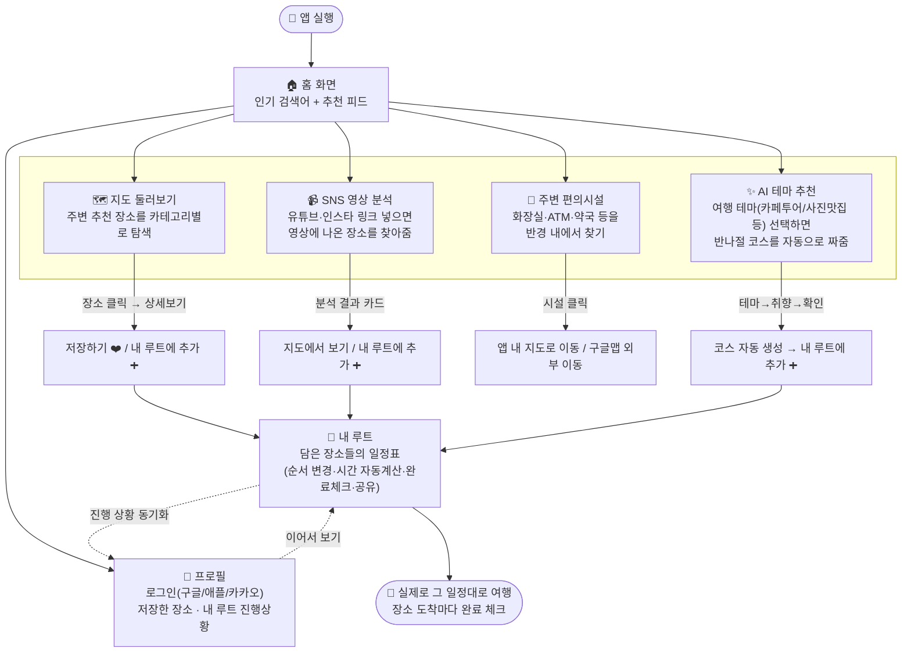
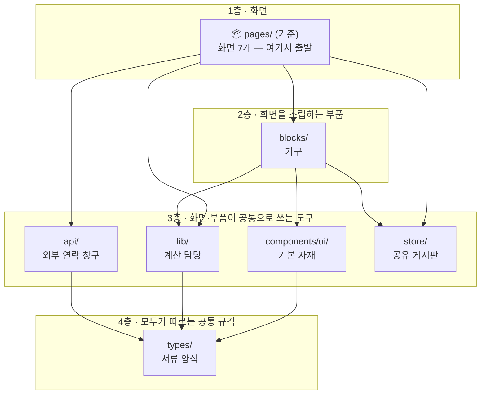
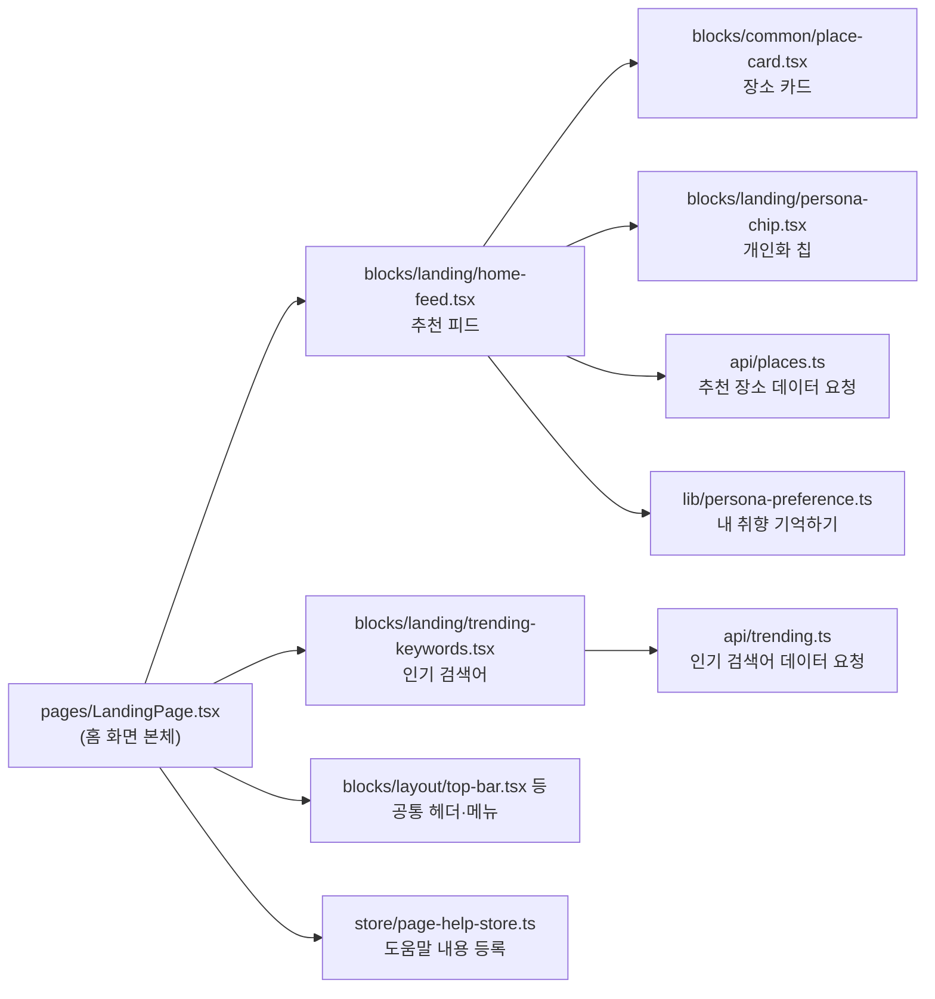
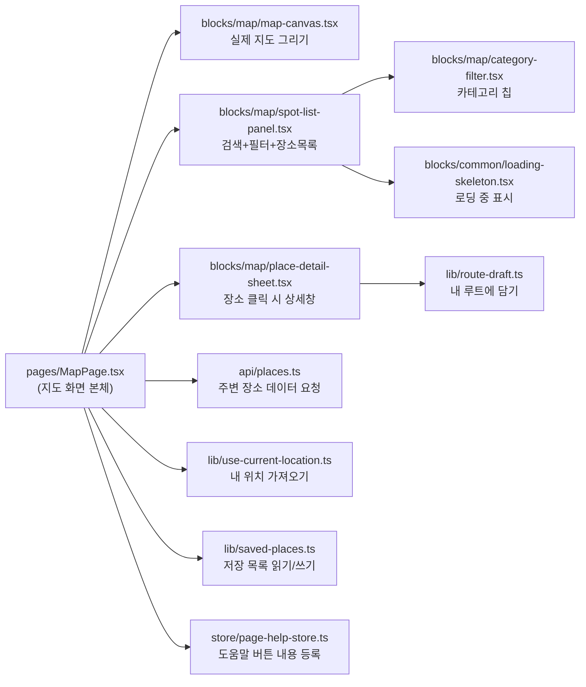
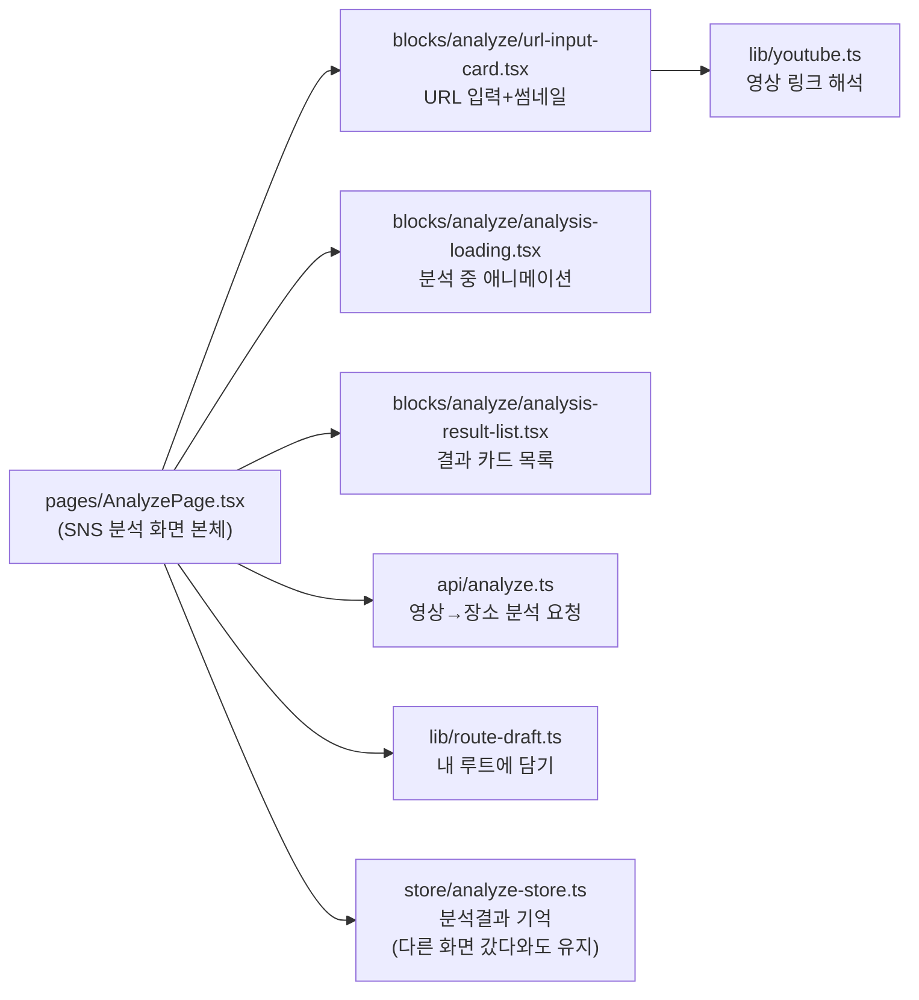
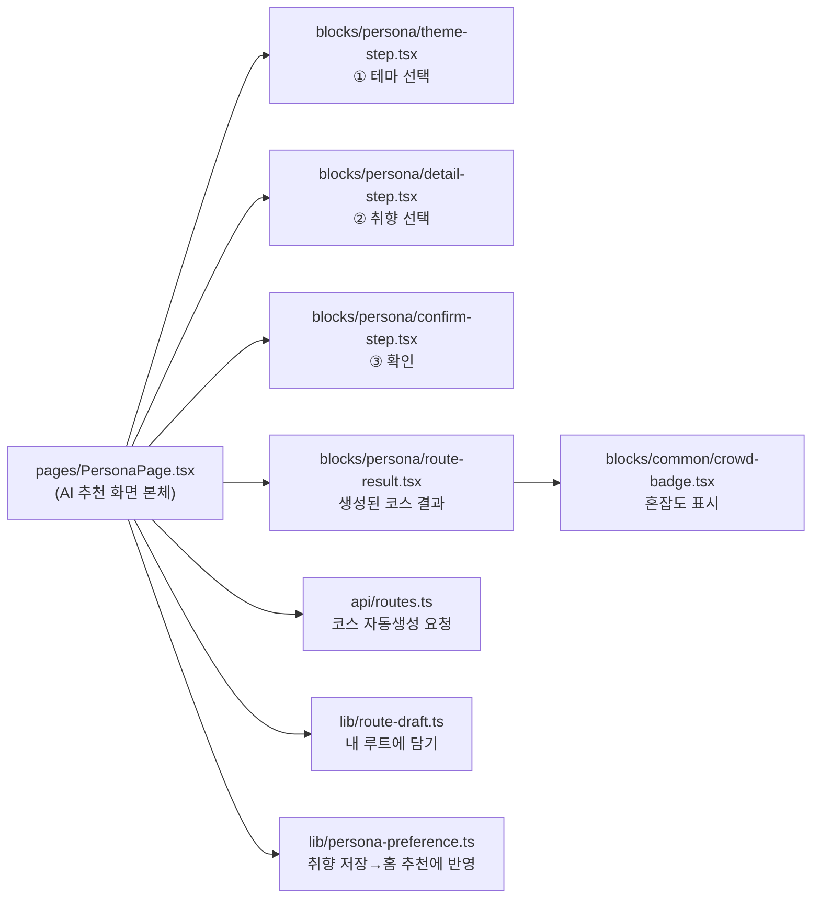
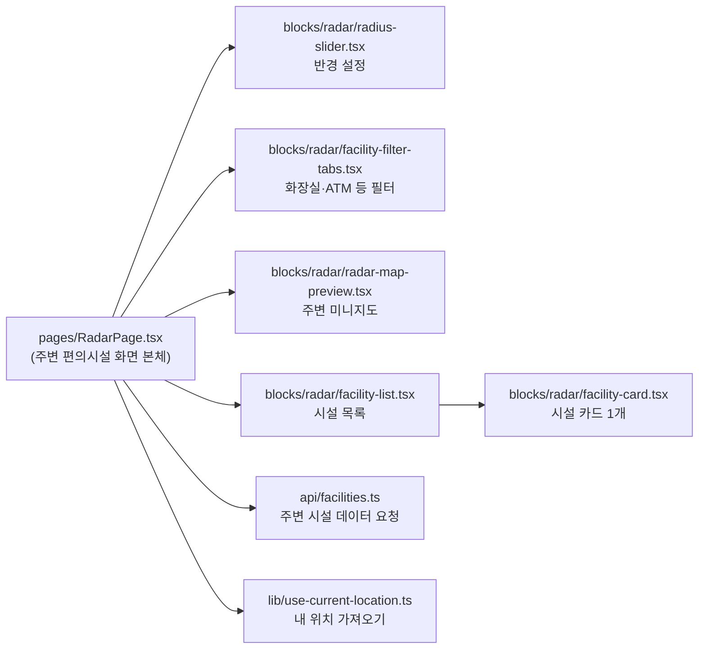
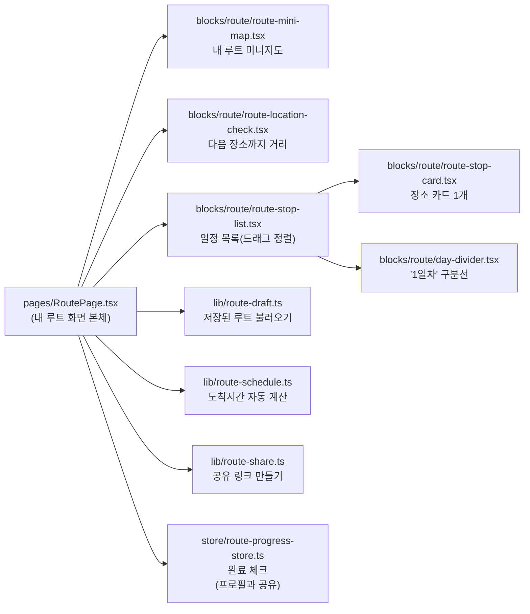
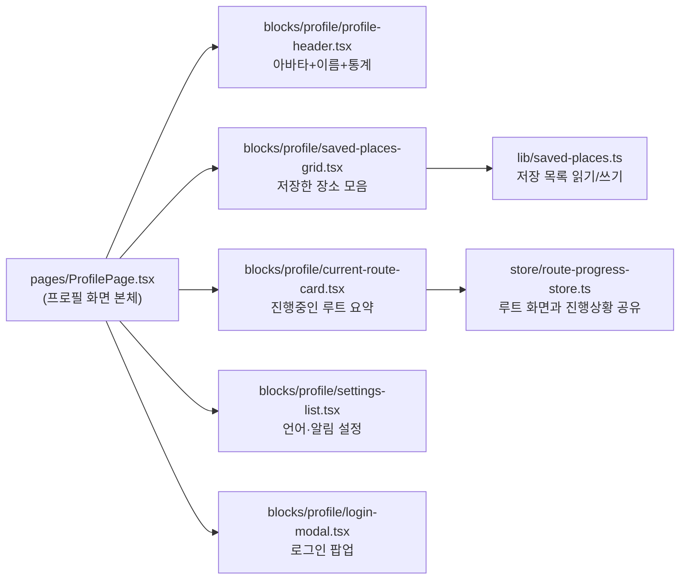

# K-Vibe 프로젝트 — 팀 공유용 한눈에 보기

> 비개발자 팀원에게 "이 프로젝트가 어떻게 생겼고 어떻게 동작하는지" 설명하기 위한 문서입니다.
> 코드 한 줄 없이도 이해할 수 있도록 비유 위주로 작성했습니다.
>
> 💡 아래 도표는 [Mermaid](https://mermaid.live) 문법입니다. VSCode에서는 그대로 미리보기가 뜨고,
> GitHub에 올리면 자동으로 그림으로 렌더링됩니다. 슬라이드에 이미지로 넣고 싶다면 코드 블록 안의
> 내용을 통째로 복사해서 https://mermaid.live 에 붙여넣으면 PNG로 다운로드할 수 있습니다.

---

## 1. 이 앱은 무엇인가 (한 줄 요약)

**외국인 관광객을 위한 K-Culture 여행 앱.** 
"어디 갈지 추천받기 → 내 일정에 담기 → 일정대로 다니기"가 핵심 흐름이고, 
추천을 받는 방법이 4가지(지도 둘러보기 / SNS 영상 분석 / AI 테마 추천 / 주변 편의시설 찾기) 있다고 보면 됩니다.

---

## 2. 앱 동작 시나리오 (사용자가 실제로 하는 일)

**핵심 포인트**: 지도/SNS분석/AI추천 3개 화면은 "추천받는 방법"만 다를 뿐, 결국 전부
**"내 루트"** 화면 하나로 모입니다. 즉 사용자 입장에선 "어떤 방법으로 찾았든 결국 한 곳(내 루트)에
모아서 일정처럼 관리한다"가 이 앱의 본질입니다.

---

## 3. 폴더 구조와 각 폴더의 역할

`src/` 안에 있는 폴더들을 "건축"에 비유하면 이렇습니다.

| 폴더 | 비유 | 실제 역할 |
|------|------|----------|
| `pages/` | **완성된 7개의 방(화면)** | 사용자가 실제로 보는 화면 단위. 홈/지도/SNS분석/AI추천/내루트/주변시설/프로필 |
| `blocks/` | **방을 채우는 가구(조립 부품)** | 화면 하나를 구성하는 카드, 목록, 버튼 묶음 등 — 여러 화면이 같은 가구를 재사용하기도 함 |
| `components/ui/` | **가구를 만드는 기본 자재(못, 나사, 판자)** | 버튼/카드 틀처럼 가장 작은 기본 부품. 외부 도구(shadcn)가 자동으로 만들어준 것이라 직접 수정 안 함 |
| `api/` | **외부와 연락하는 창구(전화 상담원)** | 서버(백엔드)에 "장소 목록 줘" 같은 요청을 보내고 응답을 받아오는 곳. 서버가 아직 없을 땐 미리 준비된 가짜 데이터로 대신 응답 |
| `lib/` | **눈에 안 보이는 계산 담당 직원** | 화면엔 안 나오지만 "도보 몇 분 걸리는지 계산", "즐겨찾기 저장" 같은 로직 모음 |
| `store/` | **여러 방이 공유하는 게시판** | 다크모드 on/off처럼 여러 화면이 동시에 알아야 하는 정보를 붙여두는 곳 |
| `types/` | **서류 양식** | "장소 데이터는 이름·주소·좌표가 있어야 한다" 같은 데이터의 정해진 모양 |
| `messages/` | **번역기** | 한국어/영어/일본어/중국어 4개 언어의 화면 문구 모음 |
| `router/` | **안내 데스크** | 주소창의 URL을 보고 "이 손님은 몇 호실(어느 화면)로 안내할지" 결정 |
| `assets/` | **로고·아이콘 보관함** | 로고 이미지 등 |

### 파일 간 관계 (누가 누구를 불러 쓰는가)

**기준(출발점)은 `pages/`입니다.** "화면이 필요한 부품을 가져다 쓴다"는 한 방향으로만 읽으면 됩니다 —
아래로 내려갈수록 더 작고 공통적인 부품이고, 화살표는 항상 **위(화면) → 아래(부품/도구)** 로만 흐릅니다.
(`router/`/`messages/`는 모든 화면에 걸쳐 쓰이는 보조 도구라 다이어그램에서는 빼고 위 표로만 설명합니다.)

즉 작은 부품(`lib/`, `types/`, `components/ui/`)은 자기를 누가 쓰는지 전혀 모르고, 화면(`pages/`)이
필요한 부품들을 가져다 조립하는 구조입니다. 그래서 부품 하나를 고쳐도 영향 범위가 예측 가능합니다.
(참고: `blocks/` 안에서도 큰 부품이 작은 부품을 가져다 쓰는 경우가 있습니다 — 예를 들어 지도 화면의
"장소 목록" 부품이 "카테고리 필터" 부품을 안에 품고 있는 식. 같은 층 안에서의 재사용이라 위 도표에서는
생략했습니다.)

### 실제 예시 — 7개 화면 전부 살펴보기

화면 본체(`pages/`) 하나만 보면 안 되고, 이렇게 여러 부품이 조립돼서 만들어진다는 걸 보여드리는
예시입니다. 7개 화면 전부 똑같은 패턴(화면 → 조립부품 + 데이터창구 + 계산담당)으로 만들어져
있습니다.

---
#### ① 홈 (`LandingPage`)

---
#### ② 지도 (`MapPage`)

---
#### ③ SNS 영상 분석 (`AnalyzePage`)

---
#### ④ AI 테마 추천 (`PersonaPage`)

---
#### ⑤ 주변 편의시설 (`RadarPage`)

---
#### ⑥ 내 루트 (`RoutePage`)

---
#### ⑦ 프로필 (`ProfilePage`)

---

## 4. 발표 팁

- 2번(시나리오 플로우맵)을 먼저 보여주면서 **"앱이 뭘 하는지"**를 설명하고,
- 그다음 3번(폴더 구조)으로 넘어가서 **"그 화면들이 코드상으로 어떻게 나뉘어 있는지"**를 설명하는 순서를 추천합니다.
- "내 루트가 모든 추천 기능의 종착지"라는 한 문장이 이 앱 전체를 설명하는 가장 쉬운 한 줄입니다.
